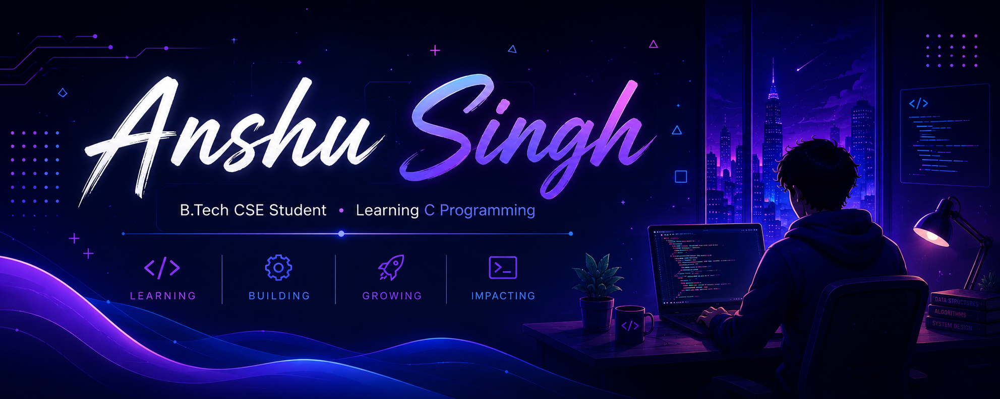
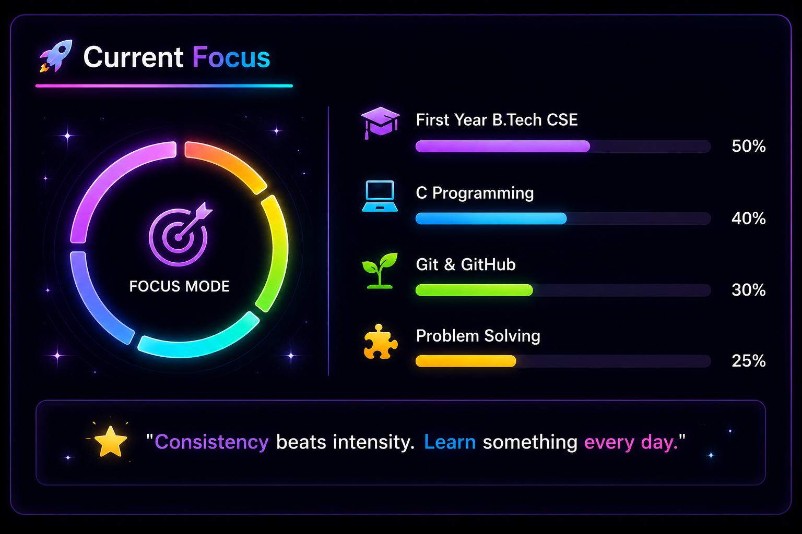
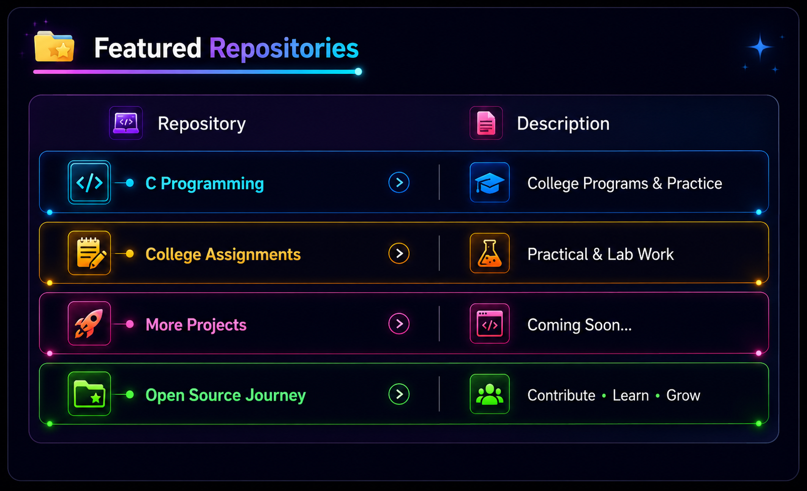
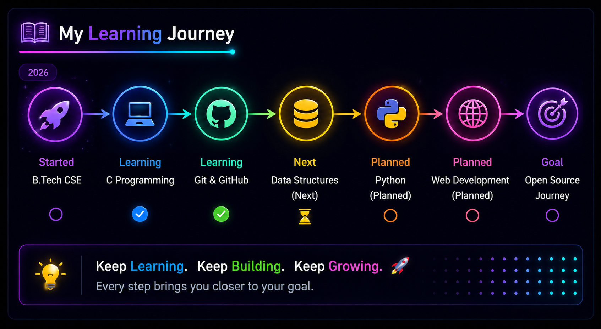

  

  

# 💫 About Me

🎓 First-Year **B.Tech Computer Science Engineering** Student

💻 Currently learning **C Programming**

🌱 Exploring **Git & GitHub**

🚀 Building a strong programming foundation

🎯 Goal: Become a Skilled Software Engineer

📍 Indore, Madhya Pradesh, India 🇮🇳

 

## 🛠️ Tech Stack

---

## 📚 Currently Learning

| Skill | Progress |
|-------|----------|
| C | 🟩🟩🟩🟩⬜ 80% |
| Git | 🟩🟩🟩⬜⬜ 60% |
| GitHub | 🟩🟩🟩⬜⬜ 60% |
| Problem Solving | 🟩🟩⬜⬜⬜ 40% |

---

## 🎯 2026 Goals

- ✅ Build a strong foundation in **C Programming**
- ✅ Learn **Git & GitHub**
- ⏳ Start **Data Structures & Algorithms**
- ⏳ Learn **Python**
- ⏳ Learn **HTML & CSS**
- ⏳ Build my first real-world projects
- ⏳ Contribute to Open Source

## 🐍 Anshu Singh's Contribution Snake

  

---
## 📊 GitHub Analytics

 

---

## 📈 Contribution Graph

---

  

  

## 🎯 Current Goals

- ✅ Strengthen C Programming
- ✅ Practice Coding Every Day
- ⏳ Build My First GitHub Project
- ⏳ Learn Git & GitHub Properly
- ⏳ Start Data Structures

---

## 💡 Developer Mindset

> **"I don't compare myself with others. I compare myself with who I was yesterday."**

---

## 🏆 GitHub Achievements

---

## 🌐 Connect With Me

---

## 👀 Profile Views

---

### ⭐ Thanks for visiting my profile.

**Learning • Building • Growing 🚀**

---

