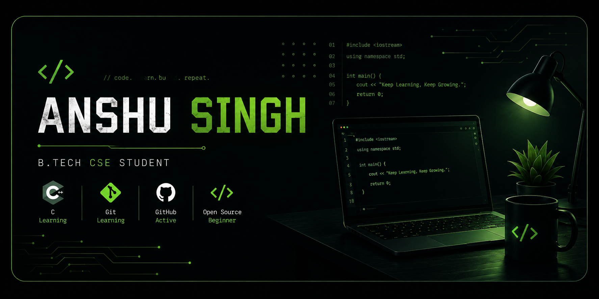

  

  

## 💻 About Me

🎓 **B.Tech Computer Science Engineering — 2nd Year**

💡 Passionate about **Programming, Problem Solving & Software Development**.

🧠 Exploring **Data Structures & Algorithms** through practical projects.

🛠️ Learning and working with **modern development tools & technologies**.

🚀 Aspiring **Software Engineer** focused on continuous learning and growth.

📍 **Indore, Madhya Pradesh, India**

> 💚 *Code. Learn. Improve. Repeat.*
>
> ## 🛠️ Tech Stack
> > Technologies I have learned, explored, and continue to improve.

---

## 📚 Currently Learning

| 📌 Area | 🔍 Focus |
| :--- | :--- |
| 🧠 Data Structures & Algorithms | Problem Solving & Core Concepts |
| 🐍 Python | Programming & Practical Applications |
| 🌐 Web Development | HTML, CSS & Web Fundamentals |
| 🛠️ Git & GitHub | Version Control & Collaboration |
| 💻 Software Development | Building Practical Projects |

---

## 🎯 Current Focus

- 🧠 Strengthening **Data Structures & Algorithms**
- 💻 Building **practical software projects**
- 🐍 Expanding my programming skills with **Python**
- 🛠️ Improving my **Git & GitHub workflow**
- 🌐 Exploring **modern web technologies**
- 🌱 Contributing to **Open Source**

- 
## 🐍 Contribution Snake

---
## 📊 GitHub Analytics

  

---

## 📈 Contribution Graph

---

## 💡 Developer Mindset

> *"I don't compare myself with others.  
> I compare myself with who I was yesterday."*

---

---

## 🌐 Connect With Me

  
  

---

## 👀 Profile Views

---

---

## ⭐ Thanks for Visiting!

> *Learning • Building • Growing* 🚀

  ⭐ If you find my projects interesting, feel free to explore my repositories!

---

